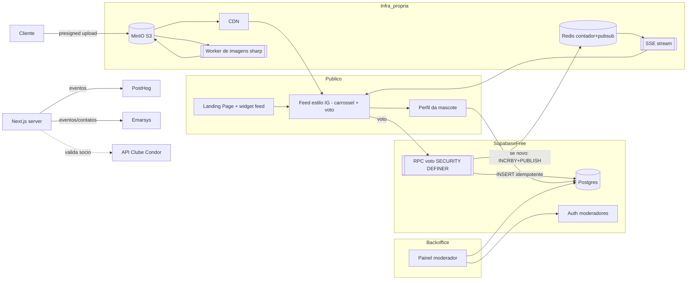
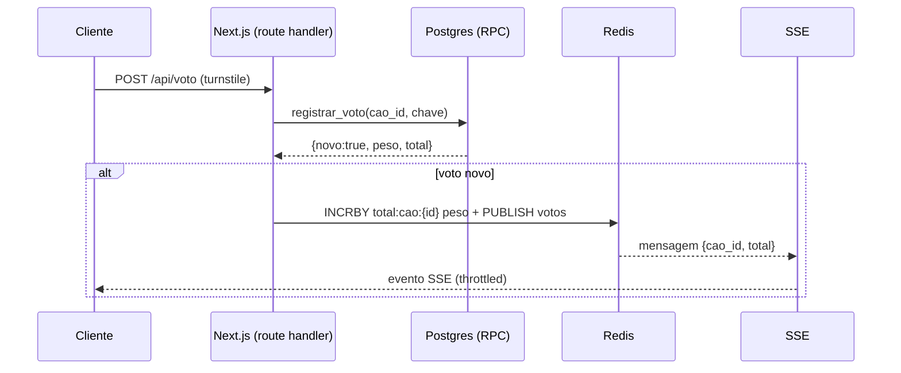

# SPEC — Concurso de Mascotes (PetVote)

**Estado:** Draft v0.2 — deriva de `00-prd.md`
**Lead técnico:** a definir · **Nível de risco predominante:** médio (votação = fluxo de negócio compartilhado)
**Infra:** Supabase **Free** (Postgres + Auth) · MinIO self-hosted (S3) + CDN para fotos

## 1. Decisão de arquitetura

Aplicação **Next.js (App Router)** full-stack hospedando três frentes públicas (landing, feed, perfil da mascote) + backoffice autenticado. Backend em **Supabase Free** (Postgres + Auth de moderadores). As **fotos ficam no MinIO** (S3-compatible, nos nossos servidores) e são servidas otimizadas pela **CDN** — não usamos Supabase Storage, para preservar as cotas do free tier. Eventos de produto vão a **PostHog** e de CRM a **Emarsys**, disparados do servidor.

**Organização do código: monorepo.** O projeto é um **monorepo** (pnpm workspaces + Turborepo) reunindo o app web, o worker de imagens, o agente de CI e pacotes compartilhados (schema/DB, tracking, config). Motivo: os componentes compartilham tipos e contratos (ex.: modelo de dados, nomes de eventos) e o build/lint/test incrementais do Turborepo aceleram o CI. Estrutura em §8.

**Decisões-chave para o free tier:**
- A lógica de voto (idempotência + resolução de `peso_voto`) roda como **função Postgres `SECURITY DEFINER` (RPC)** chamada por um route handler do Next.js — resolve a concorrência dentro da transação do banco e **não consome cota de Edge Functions**. O peso é derivado do estado da mascote, nunca enviado pelo cliente.
- **Edge Functions** ficam reservadas apenas para integrações externas com segredo (Emarsys, validação Condor); podem inclusive ser route handlers do Next.js se quisermos economizar ainda mais a cota.
- **Upload de fotos direto do cliente ao MinIO via presigned URL** (o original não passa por Supabase nem, idealmente, pelo Next). Um **worker de imagens** gera as variantes otimizadas (ver §Pipeline de imagens).
- **Realtime do voto = híbrido Redis + SSE.** O Postgres (RPC) continua sendo a **fonte da verdade** (idempotência/anti-fraude). Um **Redis** no nosso servidor mantém o **contador quente** por mascote e um canal pub/sub; o total "ao vivo" é entregue ao cliente por **SSE com throttle** (ver §Realtime). Evita estourar as cotas do Supabase Free e mantém o controle no nosso lado.

Opções consideradas:
- **A) Next.js + Supabase (escolhida)** — menor custo operacional, Postgres relacional forte para constraints de unicidade, Storage e Auth integrados. Aderente ao stack já decidido.
- **B) Next.js + backend próprio (Node/Nest) + Postgres gerenciado** — mais controle, porém mais infra e tempo; descartada por over-engineering para o MVP.
- **C) Backend serverless puro (funções isoladas) + Firebase** — descartada: modelo NoSQL dificulta a constraint de unicidade de voto e os rankings agregados.



## 2. Stack técnico

| Camada | Escolha | Alternativas consideradas |
|---|---|---|
| Frontend/SSR | Next.js (App Router) + TypeScript | Remix, Astro |
| UI | React + Tailwind (skills: front-design/hallmark/caveman) | MUI, Chakra |
| Backend/DB | Supabase **Free** Postgres | Firebase, Neon + backend próprio |
| Fotos | **MinIO** self-hosted (S3) + CDN | Supabase Storage (descartado: cota free), Cloudinary |
| Processamento de imagem | Worker Node + **sharp** (WebP/AVIF) | Edge Function (descartado: CPU/cota), on-the-fly na CDN |
| Auth (backoffice) | Supabase Auth (email+senha, RLS) | Auth0, Clerk |
| Lógica de voto | **Função Postgres RPC** (SECURITY DEFINER) | Edge Function (gasta cota free), route handler puro |
| Realtime voto | **Redis** (contador + pub/sub) + **SSE** com throttle | Supabase Realtime (limites do Free), polling puro |
| Anti-fraude | Cloudflare Turnstile + fingerprint + rate-limit + honeypot | reCAPTCHA, login obrigatório (descartado por decisão de produto) |
| Analytics produto | PostHog | GA4, Mixpanel |
| CRM/Marketing | Emarsys | Klaviyo, HubSpot |
| Feature flags | flag `ff_condor_x2` (PostHog flags ou tabela config) | LaunchDarkly |

## 3. Modelo de dados

Convenção de nomenclatura por domínio com prefixo (ex.: `cao_`). Esquema inicial (Postgres):

```sql
-- Participante (dono da mascote)
create table participante (
  id uuid primary key default gen_random_uuid(),
  nome text not null,
  email text not null unique,
  dono_condor boolean not null default false,   -- validado via API Condor (atrás de ff_condor_x2)
  criado_em timestamptz not null default now()
);

-- Mascote
create table cao (
  id uuid primary key default gen_random_uuid(),
  participante_id uuid not null references participante(id),
  nome text not null,
  raca text,
  peso_voto smallint not null default 1,         -- 2 se dono_condor (resolvido no servidor)
  visualizacoes integer not null default 0,
  slug text not null unique,                      -- URL curta compartilhável
  status text not null default 'pendente',        -- 'pendente' | 'aprovado' | 'reprovado'
  moderador_id uuid,                               -- quem moderou
  motivo_reprova text,                             -- opcional, se reprovado
  moderado_em timestamptz,
  criado_em timestamptz not null default now()
);

-- Fotos da mascote (1 a 5), no MinIO/CDN
create table cao_foto (
  id uuid primary key default gen_random_uuid(),
  cao_id uuid not null references cao(id) on delete cascade,
  ordem smallint not null,                         -- posição no carrossel (1..5)
  key_original text not null,                      -- chave no bucket MinIO
  url_thumb text,                                  -- variante feed (CDN)
  url_medium text,                                 -- variante perfil (CDN)
  status_proc text not null default 'pendente',    -- 'pendente' | 'ok' | 'erro'
  criado_em timestamptz not null default now(),
  unique (cao_id, ordem),
  check (ordem between 1 and 5)
);
-- Regra "máx. 5 fotos por mascote" reforçada no servidor (app) + trigger opcional.

-- Voto (idempotência por chave do votante)
create table voto (
  id uuid primary key default gen_random_uuid(),
  cao_id uuid not null references cao(id),
  chave_votante text not null,                    -- hash(ip + cookie + fingerprint)
  peso smallint not null,                          -- copiado de cao.peso_voto no momento do voto
  criado_em timestamptz not null default now(),
  unique (cao_id, chave_votante)                   -- no máximo 1 voto por votante por mascote
);

-- Regulamento
create table regulamento (
  id uuid primary key default gen_random_uuid(),
  arquivo_url text not null,
  versao text not null,
  publicado_em timestamptz not null default now()
);

-- View de ranking (total ponderado)
create view ranking_likes as
  select c.id, c.nome, c.raca, coalesce(sum(v.peso),0) as total_votos
  from cao c left join voto v on v.cao_id = c.id
  where c.status = 'aprovado'
  group by c.id;
```

Função de voto (idempotente, resolve o peso no servidor):

```sql
create or replace function registrar_voto(p_cao_id uuid, p_chave text)
returns table(ok boolean, novo boolean, total bigint)
language plpgsql security definer as $$
declare v_peso smallint; v_status text; v_novo boolean := false;
begin
  select peso_voto, status into v_peso, v_status from cao where id = p_cao_id;
  if v_status is null or v_status <> 'aprovado' then
    return query select false, false, 0::bigint; return;         -- só vota em aprovada
  end if;
  insert into voto (cao_id, chave_votante, peso)
  values (p_cao_id, p_chave, v_peso)
  on conflict (cao_id, chave_votante) do nothing;                  -- idempotência
  get diagnostics v_novo = row_count;                              -- 1 = voto novo
  return query
    select true, v_novo > 0, coalesce(sum(peso),0)::bigint from voto where cao_id = p_cao_id;
end $$;
```

RLS: leitura pública em `cao` **apenas quando `status = 'aprovado'`** (feed, perfil, widget e rankings só veem aprovados); mascotes `pendente`/`reprovado` visíveis somente para moderadores. Escrita de voto só via Edge Function (`service_role`) e apenas em mascote aprovada; tabelas de backoffice restritas a moderadores autenticados.

## 4. Contratos de API

| Método | Rota | Descrição |
|---|---|---|
| POST | `/api/participante` | Cria participante; (com `ff_condor_x2` ON) valida sócio Condor e seta `dono_condor` |
| POST | `/api/cao` | Cadastra mascote (dados); gera `slug`; resolve `peso_voto` |
| POST | `/api/cao/{id}/fotos/presign` | Retorna presigned URLs do MinIO (máx. 5) para upload direto |
| POST | `/api/cao/{id}/fotos/confirmar` | Registra as fotos enviadas e enfileira o processamento |
| GET | `/api/feed?cursor=` | Feed paginado de mascotes aprovadas |
| GET | `/api/cao/{slug}` | Dados públicos do perfil da mascote (incrementa `visualizacoes`) |
| POST | `/api/voto` | Registra voto idempotente (RPC); exige Turnstile; se novo → INCRBY Redis + PUBLISH |
| GET | `/api/stream/votos` | Stream SSE do total ao vivo (assina pub/sub Redis, com throttle) |
| GET | `/api/landing/widget` | Amostra de mascotes para o widget da landing |
| POST | `/api/auth/login` | Login do moderador (Supabase Auth) |
| GET | `/api/admin/moderacao` | Fila de mascotes pendentes de aprovação |
| POST | `/api/admin/cao/{id}/aprovar` | Aprova a inscrição (status → aprovado) |
| POST | `/api/admin/cao/{id}/reprovar` | Reprova a inscrição (status → reprovado + motivo) |
| GET/POST/PUT/DELETE | `/api/admin/cao` | CRUD de mascote (moderador) |
| GET | `/api/admin/rankings` | Top visualizações, Top likes, Top likes por raça |
| POST | `/api/admin/regulamento` | Upload de regulamento |
| GET | `/api/admin/participantes/export` | Exporta lista de participantes com mascote (CSV/Excel) |

## 5. Cenários de aceitação (Gherkin)

```gherkin
Feature: Cadastro de mascote
  @cad-01
  Scenario: Cadastro com foto válido
    Given um participante registrado
    When ele envia o formulário com nome, raça e uma foto
    Then a mascote é criada com status "pendente", as fotos (1 a 5) persistem no MinIO e um slug único é gerado
    And a mascote NÃO aparece no feed, perfil público, widget nem rankings

  @cad-02
  Scenario: Limite de 5 fotos
    Given uma mascote que já tem 5 fotos
    When o participante tenta enviar uma 6ª foto
    Then a requisição é rejeitada

  @cad-03
  Scenario: Foto otimizada servida pela CDN
    Given uma foto recém-enviada ao MinIO
    When o worker de imagens processa o original
    Then são geradas variantes thumb e medium em WebP/AVIF
    And url_thumb/url_medium são preenchidas e status_proc = "ok"

Feature: Feed estilo Instagram
  @feed-01
  Scenario: Carrossel de fotos
    Given uma mascote aprovada com 3 fotos
    When o card aparece no feed
    Then o usuário pode navegar as 3 fotos em carrossel (swipe/setas)
    And vê o botão de voto e o de compartilhar
    And o evento "cadastro_mascote" é enviado a PostHog e Emarsys

Feature: Moderação de inscrições
  @mod-01
  Scenario: Mascote pendente é aprovada
    Given uma mascote com status "pendente"
    And um moderador autenticado
    When o moderador aprova a inscrição
    Then o status muda para "aprovado"
    And a mascote passa a aparecer no feed e a receber votos

  @mod-02
  Scenario: Mascote pendente é reprovada
    Given uma mascote com status "pendente"
    And um moderador autenticado
    When o moderador reprova a inscrição com um motivo
    Then o status muda para "reprovado"
    And a mascote continua invisível ao público

  @mod-03
  Scenario: Voto em mascote não aprovada é rejeitado
    Given uma mascote com status "pendente" ou "reprovado"
    When alguém tenta votar nessa mascote
    Then o voto é rejeitado

Feature: Votação sem login
  @voto-01
  Scenario: Primeiro voto é contabilizado
    Given uma mascote aprovada com peso_voto = 1
    And um votante que passou o desafio Turnstile
    When ele vota na mascote pela primeira vez
    Then é criado 1 registro de voto com peso 1
    And o total da mascote aumenta em 1
    And o total ao vivo é atualizado nos clientes conectados via SSE

  @voto-02
  Scenario: Redis fora do ar não perde votos
    Given o Redis está indisponível
    When um voto novo é registrado
    Then o voto persiste no Postgres normalmente
    And ao voltar, o contador do Redis é reconstruído a partir do Postgres

  @voto-03
  Scenario: Voto duplicado do mesmo votante é rejeitado
    Given um votante que já votou na mascote X
    When ele tenta votar novamente na mascote X
    Then nenhum novo registro é criado
    And o total da mascote permanece igual

  @voto-04
  Scenario: Requisição automatizada é bloqueada
    Given uma requisição de voto sem token Turnstile válido
    When ela chega ao endpoint de voto
    Then o voto é rejeitado antes de contabilizar
    And o evento "voto_bloqueado" é enviado a PostHog

Feature: Peso x2 Clube Condor (atrás de ff_condor_x2, pendente aprovação do PO)
  @condor-01
  Scenario: Voto em mascote de dono Condor vale 2
    Given a flag ff_condor_x2 está ON
    And uma mascote cujo dono foi validado como sócio Condor (peso_voto = 2)
    When um votante válido vota nessa mascote
    Then é criado 1 registro de voto com peso 2
    And o total ponderado da mascote aumenta em 2

  @condor-02
  Scenario: Flag desligada trata todos como peso 1
    Given a flag ff_condor_x2 está OFF
    When qualquer votante vota em qualquer mascote
    Then o voto é registrado com peso 1

Feature: Backoffice
  @bo-01
  Scenario: Acesso restrito
    Given um usuário não autenticado
    When ele acessa qualquer rota /api/admin/*
    Then o acesso é negado (401)

  @bo-02
  Scenario: Exportar participantes
    Given um moderador autenticado
    When ele solicita a exportação da lista de participantes
    Then recebe um arquivo CSV/Excel com participante + mascote

Feature: Landing page
  @land-01
  Scenario: Widget do feed e CTA
    Given um visitante na landing page
    When a página carrega
    Then vê um widget com amostra de mascotes e um CTA para o formulário e para o feed
    And o clique no CTA emite "landing_cta_click"
```

## 5b. Pipeline de imagens (MinIO + CDN)

Objetivo: nunca servir o original; entregar variantes leves pela CDN.

1. **Presign:** cliente pede presigned URLs (`/fotos/presign`, máx. 5); faz **upload direto ao MinIO** (bucket `originais/`). Validações: tipo (jpg/png/webp), tamanho máx. (ex. 10 MB), máx. 5 por mascote.
2. **Confirmar + enfileirar:** o cliente confirma; cria-se linha em `cao_foto` com `status_proc = 'pendente'` e um job entra na fila (tabela `fila_imagem` ou notificação ao worker).
3. **Worker (Node + `sharp`)** roda no nosso servidor: lê o original do MinIO, gera `thumb` (ex. 400px, feed) e `medium` (ex. 1080px, perfil) em **WebP/AVIF**, comprime, faz strip de EXIF, grava em `variantes/` no MinIO e atualiza `url_thumb`/`url_medium` + `status_proc = 'ok'`.
4. **Entrega:** front usa `next/image` apontando para a **CDN** do MinIO, com `srcset` (thumb no feed, medium no perfil) e `loading="lazy"`. Placeholder/blur enquanto `status_proc = 'pendente'`.

Por que não Edge Function: processar imagem é CPU-bound e a cota do free tier é limitada; o worker no nosso servidor com `sharp` é mais rápido e sem custo de invocação. A CDN já existente absorve a banda.

## 5c. Realtime do voto (Redis + SSE)

Fonte da verdade continua no Postgres; o Redis é a camada quente para o "ao vivo".

Fluxo de um voto:
1. Cliente chama `POST /api/voto` (com token Turnstile).
2. Route handler chama a RPC `registrar_voto` → Postgres decide se é **voto novo** (idempotência) e o `peso`.
3. **Se foi voto novo**, o servidor faz `INCRBY total:cao:{id} <peso>` no Redis e publica no canal `votos` `{cao_id, total}`.
4. Um endpoint **SSE** (`GET /api/stream/votos`) assina o pub/sub e envia atualizações aos clientes conectados, com **throttle/coalescing** (ex.: no máx. 1 update por mascote a cada ~1s) para não inundar.
5. O feed/perfil lê o total inicial do Redis (rápido) e depois recebe os deltas por SSE.

Consistência e recuperação:
- Redis é *cache autoritativo de leitura*, não de escrita: se o Redis cair/reiniciar, o contador é **reconstruído** a partir do Postgres (`select sum(peso) ... group by cao_id`).
- Job periódico de reconciliação Redis↔Postgres para garantir que o total quente bate com a verdade.



Nota de escala: com ~500 mascotes o footprint no Redis é mínimo. O throttle no SSE é o que segura o custo quando muitos espectadores olham o mesmo card ao mesmo tempo.

## 6. Não-funcionais

- **Escala:** ~500 inscrições (banco trivial no Supabase Free); o volume alto é de votos, absorvido pela RPC no Postgres. Cotas do free tier monitoradas (banda/DB); fotos e banda pesada ficam no MinIO+CDN, fora do Supabase.
- **Performance de imagens:** original nunca servido; variantes WebP/AVIF (thumb/medium) via CDN, `next/image` + lazy-load. Feed paginado por cursor.
- **Performance de voto:** suportar rajadas (ver Spike 1) via RPC idempotente; leitura do total pelo Redis; realtime por SSE com throttle (~1 update/mascote/s).
- **Segurança:** credenciais de PostHog/Emarsys/Condor e chaves do MinIO só no servidor; presigned URLs de curta duração; RLS ativa; escrita de voto só via RPC; LGPD nos dados de cadastro.
- **Observabilidade:** eventos em PostHog para todo o funil; logs de votos bloqueados.
- **Governança (risco médio):** feature flags obrigatórias em `ff_condor_x2`; agente revisor de CI (**Gemini**) + 1 aprovação humana; testes E2E do fluxo de voto. Rollback alvo < 10 min. Detalhe do git workflow e do pipeline em `04-workflow-cicd.md`.

## 7. Estrutura do monorepo

```
petvote/                      # monorepo (pnpm workspaces + Turborepo)
├── apps/
│   ├── web/                  # Next.js (landing, feed, perfil, backoffice) + route handlers (voto, SSE, presign)
│   └── worker-img/           # worker Node + sharp (processa fotos do MinIO)
├── packages/
│   ├── db/                   # schema, migrações, cliente Supabase, RPC registrar_voto
│   ├── events/               # wrapper de tracking PostHog + Emarsys (nomes canônicos)
│   ├── storage/              # cliente MinIO (presign) compartilhado
│   ├── realtime/             # cliente Redis (contador + pub/sub) compartilhado
│   └── config/               # tsconfig, eslint, prettier compartilhados
├── ci/
│   └── agente-revisor.mjs    # agente revisor Gemini do pipeline
├── turbo.json
├── pnpm-workspace.yaml
└── CLAUDE.md
```

Regras do monorepo: contratos compartilhados (tipos do modelo de dados, nomes de eventos) vivem em `packages/*` e são importados pelos `apps/*` — nada de duplicar. O CI usa o grafo do Turborepo para rodar lint/test/build **apenas nos projetos afetados** pelo diff.

## 9. CLAUDE.md — pontos a incluir

- Nomenclatura de tabelas com prefixo por domínio (`cao_`, `voto_`, etc.).
- Peso do voto SEMPRE resolvido no servidor; cliente nunca envia `peso`.
- Nenhuma credencial de PostHog/Emarsys/Condor no bundle do cliente.
- Branches `feat/`, `fix/`, `chore/`, `spike/`; `staging` e `main` permanentes.
- PR template com checklist de cenários Gherkin cobertos + disclosure de IA (tag `[ai-assisted]`, sem nomear fornecedor).
- Mudanças em lógica de voto/auth = risco alto → 2 aprovações + QA manual + feature flag.
