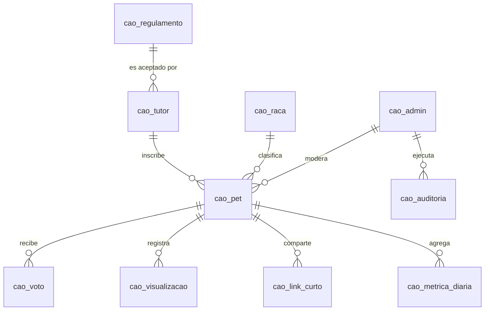

# Arquitectura de la Plataforma Cãocurso — Documento de Discusión Técnica

> **Estado:** borrador para discusión. No es una decisión tomada.
> **Fecha:** 2026-07-29 · **Autor:** Armando Castro + Claude
> **Alcance:** todo lo que existe *después* de que el usuario pulsa «Inscreva-se» en la LP.

---

## 0. Cómo leer este documento

Está ordenado de lo que **bloquea** a lo que se puede decidir después:

| § | Sección | Para qué sirve |
|---|---------|----------------|
| 1 | Resumen y recomendación | La conclusión, si no vas a leer el resto |
| 2 | Las tres superficies | El error de encuadre que hay que corregir primero |
| 3 | Decisiones abiertas | Lo que no puedo cerrar yo |
| 4 | Modelo de datos | El entregable central: entidades, DDL, índices |
| 5 | Votación y anti-fraude | Donde el proyecto se puede caer públicamente |
| 6 | Fotos y storage | El verdadero driver de costo |
| 7 | Integraciones (Emarsys, PostHog) | Patrón outbox y consentimiento |
| 8 | Backoffice | Requisitos mapeados contra el modelo |
| 9 | **InsForge vs Supabase** | La evaluación que pidió tu jefe |
| 10 | LGPD | Obligaciones concretas, no genéricas |
| 11 | Riesgos | Lo que puede salir mal, ordenado por daño |
| 12 | Agenda de la discusión | Preguntas para la reunión |

**Convención de marcado a lo largo del documento:**

- ✅ **Verificado** — comprobado en fuente primaria (link incluido)
- ⚠️ **Supuesto** — inferido, hay que confirmarlo
- ❓ **Desconocido** — bloqueante, nadie lo ha contestado

---

## 1. Resumen ejecutivo y recomendación

### El planteamiento actual, en una frase

Una LP de captación (`pet.condor.com.br`) manda inscripciones a un backoffice
independiente que guarda datos + fotos, y encima de eso corre un concurso de votación
pública tipo feed de Instagram, con jueces mirando rankings desde un panel interno.

### Las tres correcciones de fondo que propongo

**1. No son dos sistemas, son tres.** La LP y el backoffice no cubren el feed público de
votación, que es la superficie con más tráfico, más riesgo reputacional y más carga de
imágenes de todo el proyecto. Hoy no tiene dueño en el diseño. → §2

**2. «Un like por IP» no se puede implementar como está escrito.** En Brasil el móvil sale
por CGNAT: una IP pública puede tapar decenas de miles de abonados de la misma operadora.
Limitar por IP significaría que en Vivo/Claro/TIM **vota una persona y el resto queda
bloqueada**. La IP sirve como *señal* de fraude, nunca como *llave* de unicidad. → §5

**3. La raza no se está capturando y el premio depende de ella.** El backoffice pide «Top
Like por raza» pero el formulario actual sólo guarda especie (Cão/Gato). Si la raza entra
después, hay que recontactar a todos los inscritos. **Es un cambio de una hora hoy y una
campaña de recuperación dentro de un mes.** → §4.3

### Recomendación sobre la plataforma

**Supabase para esta campaña. InsForge no todavía.**

No porque InsForge sea mala — técnicamente es sólida y en algunos aspectos encaja mejor con
cómo estamos construyendo (es agent-native, MCP nativo, Apache-2.0). El problema es el
perfil de riesgo contra *este* proyecto concreto:

| | InsForge | Supabase |
|---|---|---|
| Empresa | Fundada 2025, ~6 personas, YC batch P26 (marzo 2026) ✅ | Fundada 2020, cientos de empleados, usada en producción a gran escala ✅ |
| Región Brasil | **No publica regiones ni residencia de datos** ❓ | `sa-east-1` São Paulo disponible ✅ |
| Compliance | SOC2/HIPAA sólo en Enterprise; sin DPA público ⚠️ | SOC2 Tipo 2, HIPAA, DPA público ✅ |
| SLA / backups / PITR | No publicado ❓ | Publicado por plan ✅ |
| Precio Pro | $25/mes ✅ | $25/mes ✅ |

Los tres factores decisivos son, en orden:

1. **Residencia de datos.** Vamos a guardar nombre, email, teléfono y fotos de miles de
   brasileños bajo la marca Condor. InsForge no publica dónde vive esa data. Sin esa
   respuesta no se puede firmar nada. → §10
2. **Fecha dura.** Un concurso con premio tiene una fecha de cierre que no se mueve. Una
   plataforma de 4 meses de vida en el mercado tiene un histórico operativo que todavía no
   existe. No es un juicio sobre su calidad; es que no hay datos.
3. **Compras y jurídico de Condor.** Un proveedor de 6 personas sin DPA publicado es una
   conversación larga con el departamento legal de un retailer grande. Supabase ya está
   homologada en muchas empresas de ese tamaño.

**El contraargumento honesto a favor de InsForge**, que merece estar sobre la mesa: es
Apache-2.0 y self-hostable sin diferencias funcionales con la versión gestionada. Si Condor
quiere la data en su propia infra en Brasil, InsForge self-hosted lo resuelve — pero
entonces **Condor asume la operación** (backups, parches, uptime, guardias). Eso es una
decisión de TI de Condor, no nuestra. Y Supabase también es self-hostable, así que esa
carta no es exclusiva de InsForge.

**Propuesta de salida diplomática:** si tu jefe quiere InsForge por razones estratégicas,
la ruta sana es usarla en un proyecto interno sin datos personales y sin fecha dura, y
medir cómo se comporta durante un trimestre. Meterla directamente en una campaña de marca
con LGPD encima es donde el riesgo no compensa.

Detalle completo en **§9**.

---

## 2. Las tres superficies

### El error de encuadre

Estás usando «backoffice» para dos cosas con requisitos opuestos:

- **El dueño de los datos** — base, storage, API, integraciones. Tiene que ser alcanzable
  por la LP (para escribir) y por el feed (para leer y votar).
- **La UI de administración** — jueces, CRUD, exportaciones. Privada, con login, sin
  ninguna relación con el tráfico público.

Y falta una tercera superficie que mencionaste de pasada pero que es la más pesada:

- **El feed público + perfil por mascota + votación.** Público, indexable, compartible en
  RRSS, y donde cae todo el pico de tráfico.

```
┌──────────────────────────┐
│  LP  pet.condor.com.br   │  Astro · marketing · tags · captación
│  (lo que ya está hecho)  │
└───────────┬──────────────┘
            │ POST inscrição
            ▼
┌──────────────────────────────────────────────────┐
│              NÚCLEO DE DATOS                     │
│   Postgres  +  Storage  +  Auth  +  Outbox       │  ← §9 decide quién
└──────┬──────────────────────────┬────────────────┘
       │ lectura pública          │ lectura+escritura privada
       ▼                          ▼
┌──────────────────┐      ┌──────────────────────┐
│  FEED PÚBLICO    │      │     BACKOFFICE       │
│  /mascota/:slug  │      │  jueces · CRUD       │
│  votación        │      │  rankings · export   │
│  ALTO TRÁFICO    │      │  BAJO TRÁFICO        │
└──────────────────┘      └──────────────────────┘
     público                  dominio aparte + auth
```

### Dónde vive cada cosa — opciones

| Opción | Feed público | Backoffice | Veredicto |
|---|---|---|---|
| **A. Monolito Next.js** | `/` de la app | `/admin` de la misma app | Simple, pero el panel comparte superficie con lo público. Un fallo de auth expone el panel. |
| **B. Dos apps, una base** ⭐ | app pública | app admin, dominio aparte | **Recomendada.** Aísla por red y por dominio; la lógica de datos no se duplica. Monorepo, dos deploys. |
| **C. API + 3 clientes** | cliente | cliente | Sobrediseño para una campaña de duración fija. |

### Sobre el dominio del feed — recomendación

**El feed debería vivir bajo `pet.condor.com.br`.** No es preferencia estética:

- El mecanismo de crecimiento del concurso es **compartir en WhatsApp**. Un link a un
  dominio desconocido tiene mucha menos tasa de clic, y en grupos grandes se lee como spam.
- El preview de WhatsApp/Instagram muestra el dominio. `condor.com.br` es un activo de
  confianza; tirarlo a la basura en el momento de máxima viralidad es caro.
- SEO: los perfiles de mascota acumulan enlaces. Bajo el dominio de campaña, ese valor
  queda en Condor.

Y **el backoffice en un dominio completamente separado** (`admin.<dominio-nuevo>`), que es
exactamente la preocupación que planteaste y es correcta. La clave: separar el *panel* del
*dato* — el panel se aísla, el dato lo comparten las tres superficies.

**Implicación que hay que aceptar:** si el feed vive en `pet.condor.com.br`, ese dominio
deja de servir HTML estático y pasa a servir contenido dinámico del backend nuevo. Es una
conversación con TI de Condor sobre DNS/CDN, y probablemente el ítem con más plazo
administrativo de todo el proyecto. **Empezarla ya.** → §11

---

## 3. Decisiones abiertas (bloqueantes)

| # | Pregunta | Bloquea | Estado |
|---|----------|---------|--------|
| D1 | ¿Existe login/API de socios de Clube Condor? | El modelo de voto entero | ❓ pendiente TI Condor |
| D2 | ¿El feed vive en `pet.condor.com.br`? | DNS, arquitectura, plazos | ❓ pendiente marca + TI |
| D3 | ¿Dónde reside la data (Brasil / fuera)? | Elección de plataforma, LGPD | ❓ pendiente jurídico |
| D4 | ¿Cuántas mascotas por tutor? | Unicidad en el modelo | ❓ pendiente regulamento |
| D5 | ¿El voto es abierto o requiere identificación? | Anti-fraude, UX, conversión | ❓ pendiente negocio |
| D6 | ¿La raza entra al formulario? | Premiación «top por raza» | ❓ **decidir esta semana** |
| D7 | ¿Volumen esperado de inscritos y visitantes? | Dimensionamiento y costo | ⚠️ estimado en §6 |
| D8 | ¿Hay jurado humano o gana el más votado? | Si el ranking es vinculante | ❓ pendiente regulamento |

D6 es el más urgente por una razón de calendario: cada día que pasa hay inscritos sin raza.

---

## 4. Modelo de datos

Nomenclatura `cao_` en todas las tablas, según indicaste. Postgres.

### 4.1 Diagrama de entidades



### 4.2 Principios que guían el modelo

1. **El consentimiento se guarda con su versión.** No basta un booleano `aceite: true`. Hay
   que poder demostrar *qué texto exacto* aceptó cada persona. Por eso
   `cao_regulamento` está versionado y `cao_tutor` apunta a la versión concreta.
2. **La IP nunca se guarda en claro.** Es dato personal bajo LGPD. Se guarda un hash con
   sal rotativa, que sirve para detectar fraude pero no para identificar a nadie.
3. **Contadores desnormalizados para el ranking.** Contar votos con `COUNT(*)` en cada
   carga del feed se cae con volumen. `votos_cache` se mantiene con trigger.
4. **Outbox para integraciones.** Emarsys nunca se llama dentro del request del usuario. Si
   Emarsys está caído, la inscripción no puede fallar.
5. **Todo lo que un juez toca queda auditado.** Un concurso con premio se impugna. Sin log
   de auditoría no hay defensa posible.

### 4.3 DDL

#### Catálogo de razas — **la corrección de alcance**

```sql
CREATE TABLE cao_raca (
  id          smallserial PRIMARY KEY,
  especie     text NOT NULL CHECK (especie IN ('cao','gato')),
  nome        text NOT NULL,
  ordem       smallint NOT NULL DEFAULT 100,
  UNIQUE (especie, nome)
);
```

> ⚠️ **Obligatorio incluir «SRD — Sem Raça Definida».** En Brasil la mayoría de los pets
> adoptados son SRD, y el concurso nace de una campaña de adopción. Si el catálogo sólo
> tiene razas de pedigree, el «Top Like por raza» premia justo a quien la campaña *no*
> quiere premiar. Sugerencia: `ordem = 1` para SRD, que salga primero en el selector.

#### Tutor

```sql
CREATE TABLE cao_tutor (
  id                      uuid PRIMARY KEY DEFAULT gen_random_uuid(),
  nome                    text        NOT NULL CHECK (length(nome) >= 3),
  email                   citext      NOT NULL,
  telefone                text        NOT NULL,
  clube_condor_id         text,                        -- null si D1 = no
  regulamento_id          int         NOT NULL REFERENCES cao_regulamento(id),
  aceite_regulamento_em   timestamptz NOT NULL,
  aceite_imagem           boolean     NOT NULL,        -- uso de imagen del pet
  opt_in_marketing        boolean     NOT NULL DEFAULT false,  -- separado: LGPD
  ip_hash                 bytea,                       -- evidencia, nunca IP cruda
  user_agent              text,
  criado_em               timestamptz NOT NULL DEFAULT now(),
  UNIQUE (email)
);
```

> **D4 abierta:** `UNIQUE(email)` permite un tutor con N mascotas. Si el regulamento dice
> «una mascota por participante», hay que añadir un índice parcial:
> `CREATE UNIQUE INDEX ON cao_pet (tutor_id) WHERE status <> 'rejeitado';`
> **No se puede escribir el modelo definitivo sin leer el regulamento.**

> **Nota sobre `opt_in_marketing`:** va separado de `aceite_regulamento` a propósito.
> Bajo LGPD el consentimiento para participar y el consentimiento para recibir marketing
> son finalidades distintas y no se pueden agrupar en un solo checkbox. Emarsys sólo debe
> recibir a quien marcó este segundo. → §10

#### Mascota

```sql
CREATE TYPE cao_status AS ENUM
  ('rascunho','pendente','aprovado','rejeitado','desclassificado');

CREATE TABLE cao_pet (
  id                  uuid PRIMARY KEY DEFAULT gen_random_uuid(),
  tutor_id            uuid NOT NULL REFERENCES cao_tutor(id) ON DELETE CASCADE,
  slug                text NOT NULL UNIQUE,      -- 'rex-a1b2c3' → /mascota/rex-a1b2c3
  nome                text NOT NULL,
  especie             text NOT NULL CHECK (especie IN ('cao','gato')),
  raca_id             smallint REFERENCES cao_raca(id),
  idade_meses         smallint CHECK (idade_meses BETWEEN 0 AND 360),
  foto_key            text NOT NULL,             -- key en storage, no URL
  foto_thumb_key      text,                      -- generado al subir → §6
  status              cao_status NOT NULL DEFAULT 'pendente',
  motivo_rejeicao     text,
  moderado_por        uuid REFERENCES cao_admin(id),
  moderado_em         timestamptz,
  votos_cache         integer NOT NULL DEFAULT 0,   -- suma de peso, no count
  visualizacoes_cache integer NOT NULL DEFAULT 0,
  criado_em           timestamptz NOT NULL DEFAULT now(),
  CHECK (status <> 'rejeitado' OR motivo_rejeicao IS NOT NULL)
);

-- Feed: sólo aprobados, ordenados por votos
CREATE INDEX cao_pet_feed_idx
  ON cao_pet (votos_cache DESC, criado_em DESC)
  WHERE status = 'aprovado';

-- Top por raza
CREATE INDEX cao_pet_raca_idx
  ON cao_pet (raca_id, votos_cache DESC)
  WHERE status = 'aprovado';
```

> **Por qué `slug` y no el UUID en la URL:** `/mascota/rex-a1b2c3` se comparte y se lee;
> `/mascota/9f8e7d6c-...` no. El sufijo aleatorio evita enumerar el concurso entero.

> **Por qué `foto_key` y no `foto_url`:** si la URL está en la base, migrar de proveedor de
> storage obliga a reescribir la tabla. Guardando la key, la URL se construye en tiempo de
> lectura. Es la diferencia entre cambiar de proveedor en una tarde o en un sprint.

#### Voto — el corazón del anti-fraude

```sql
CREATE TABLE cao_voto (
  id            bigserial PRIMARY KEY,
  pet_id        uuid NOT NULL REFERENCES cao_pet(id) ON DELETE CASCADE,
  votante_id    text,           -- id Clube Condor si D1 = sí
  device_id     uuid,           -- cookie first-party, 1 año
  ip_hash       bytea NOT NULL, -- señal de fraude, NO llave
  peso          smallint NOT NULL DEFAULT 1 CHECK (peso IN (1,2)),
  origem        text,           -- utm / canal de share
  criado_em     timestamptz NOT NULL DEFAULT now()
);

-- ESCENARIO A (existe Clube Condor): un voto por socio y mascota
CREATE UNIQUE INDEX cao_voto_socio_idx
  ON cao_voto (pet_id, votante_id) WHERE votante_id IS NOT NULL;

-- ESCENARIO B (anónimo): un voto por dispositivo y mascota
CREATE UNIQUE INDEX cao_voto_device_idx
  ON cao_voto (pet_id, device_id) WHERE votante_id IS NULL;

-- Detección de fraude: votos por IP en ventana temporal
CREATE INDEX cao_voto_fraude_idx ON cao_voto (ip_hash, criado_em DESC);
```

Mantenimiento del contador:

```sql
CREATE FUNCTION cao_atualiza_votos() RETURNS trigger AS $$
BEGIN
  UPDATE cao_pet
     SET votos_cache = votos_cache + NEW.peso
   WHERE id = NEW.pet_id;
  RETURN NEW;
END $$ LANGUAGE plpgsql;

CREATE TRIGGER cao_voto_ai AFTER INSERT ON cao_voto
  FOR EACH ROW EXECUTE FUNCTION cao_atualiza_votos();
```

> `votos_cache` suma **peso**, no filas. Con Clube Condor valiendo 2, un `COUNT(*)` daría
> un ranking incorrecto.

#### Visualizaciones

```sql
CREATE TABLE cao_visualizacao (
  id        bigserial PRIMARY KEY,
  pet_id    uuid NOT NULL REFERENCES cao_pet(id) ON DELETE CASCADE,
  device_id uuid,
  criado_em timestamptz NOT NULL DEFAULT now()
);

CREATE TABLE cao_metrica_diaria (
  pet_id         uuid NOT NULL REFERENCES cao_pet(id) ON DELETE CASCADE,
  dia            date NOT NULL,
  visualizacoes  integer NOT NULL DEFAULT 0,
  votos          integer NOT NULL DEFAULT 0,
  compartilhamentos integer NOT NULL DEFAULT 0,
  PRIMARY KEY (pet_id, dia)
);
```

> ⚠️ **Trampa: dos fuentes de verdad para «Top Visualizaciones».** Si PostHog es el dueño
> de las vistas y el backoffice también las cuenta, los números van a discrepar — y el juez
> se va a enterar justo en la final. **Regla:** lo que *premia* se cuenta en base propia; lo
> que *analiza* vive en PostHog. `cao_visualizacao` se purga a los 30 días; el rollup diario
> es el que persiste.

#### Backoffice: admins, auditoría, regulamento

```sql
CREATE TABLE cao_admin (
  id            uuid PRIMARY KEY DEFAULT gen_random_uuid(),
  email         citext NOT NULL UNIQUE,
  nome          text NOT NULL,
  senha_hash    text NOT NULL,          -- bcrypt/argon2 vía el auth de la plataforma
  papel         text NOT NULL CHECK (papel IN ('admin','jurado','leitura')),
  mfa_ativo     boolean NOT NULL DEFAULT false,
  ativo         boolean NOT NULL DEFAULT true,
  ultimo_acesso timestamptz
);

CREATE TABLE cao_auditoria (
  id          bigserial PRIMARY KEY,
  admin_id    uuid REFERENCES cao_admin(id),
  acao        text NOT NULL,          -- aprovar | rejeitar | editar | exportar | login
  entidade    text NOT NULL,
  entidade_id text,
  dados_antes jsonb,
  dados_depois jsonb,
  ip_hash     bytea,
  criado_em   timestamptz NOT NULL DEFAULT now()
);

CREATE TABLE cao_regulamento (
  id             serial PRIMARY KEY,
  versao         text NOT NULL UNIQUE,   -- '2026.1'
  arquivo_key    text NOT NULL,
  sha256         text NOT NULL,          -- integridad: prueba de no alteración
  vigente_desde  timestamptz NOT NULL,
  publicado_por  uuid REFERENCES cao_admin(id)
);
```

> **`sha256` no es paranoia.** Si alguien impugna el concurso alegando que el reglamento
> cambió después de su inscripción, el hash es la prueba de que no. Cuesta una línea.

> **`cao_auditoria` cubre también `exportar`.** La lista de participantes contiene datos
> personales de miles de personas; quién la descargó y cuándo es exactamente lo que va a
> preguntar el DPO si hay una fuga.

#### Links cortos y compartir

```sql
CREATE TABLE cao_link_curto (
  codigo    text PRIMARY KEY,          -- base62, 7 chars
  pet_id    uuid NOT NULL REFERENCES cao_pet(id) ON DELETE CASCADE,
  canal     text,                      -- whatsapp | instagram | facebook | x | copiar
  cliques   integer NOT NULL DEFAULT 0,
  criado_em timestamptz NOT NULL DEFAULT now()
);
```

> Acortador propio en vez de bit.ly: el dominio del link es el de la campaña (confianza al
> compartir), el clic se atribuye sin depender de un tercero, y no hay cuota mensual.

#### Outbox de integraciones

```sql
CREATE TABLE cao_evento_integracao (
  id         bigserial PRIMARY KEY,
  tipo       text NOT NULL,     -- cao_inscricao_concluida, cao_foto_aprovada...
  destino    text NOT NULL,     -- emarsys | posthog
  payload    jsonb NOT NULL,
  status     text NOT NULL DEFAULT 'pendente'
             CHECK (status IN ('pendente','enviado','falhou','descartado')),
  tentativas smallint NOT NULL DEFAULT 0,
  erro       text,
  criado_em  timestamptz NOT NULL DEFAULT now(),
  enviado_em timestamptz
);

CREATE INDEX cao_outbox_pendente_idx
  ON cao_evento_integracao (criado_em) WHERE status = 'pendente';
```

---

## 5. Votación y anti-fraude

### 5.1 Por qué «un like por IP» rompe el concurso

En Brasil las operadoras móviles usan **CGNAT**: miles de abonados comparten una misma IP
pública de salida. Consecuencia directa de la regla tal como está escrita:

- El primer usuario de Vivo que vote «gasta» la IP.
- Todos los demás detrás de ese NAT reciben *ya votaste*.
- El mismo efecto en oficinas, escuelas y wifi de shoppings.

Y en la dirección contraria, tampoco protege: cambiar de IP es poner el móvil en modo avión
y volver, o usar una VPN gratuita.

**Conclusión: la IP es una buena señal de fraude y una pésima llave de unicidad.**
Se usa así: `cao_voto.ip_hash` indexado por tiempo, y una alerta cuando una IP supera N
votos/hora — para *investigar*, no para *bloquear automáticamente*.

### 5.2 Los dos escenarios (D1)

#### Escenario A — existe login de Clube Condor ⭐ preferido

```
Votante → login Clube Condor → voto identificado (peso 2)
                             → unique(pet_id, votante_id)
```

- El fraude cae a crear cuentas falsas de socio, que ya tiene fricción propia.
- El peso ×2 sale gratis: es un atributo del votante autenticado.
- **Beneficio de negocio que no es obvio:** cada voto se convierte en un touchpoint
  identificado del programa de fidelidad. El concurso deja de ser sólo captación y pasa a
  ser activación de base. Ese argumento vale más que el técnico para justificar la
  integración ante Condor.

#### Escenario B — no existe

Tres niveles, de menos a más fricción:

| Nivel | Mecanismo | Fraude | Fricción |
|---|---|---|---|
| B1 | Cookie `device_id` + rate limit por IP | **Alto** — se gamea el día 1 | Ninguna |
| B2 | OTP por email o SMS antes del primer voto | Bajo | Media |
| B3 | Sólo votan tutores inscritos | Muy bajo | Alta (mata el alcance) |

**Recomendación: B2.** Convierte el voto en identificado sin depender de Clube Condor, y el
email capturado alimenta la base de marketing — que es el objetivo real de la campaña. Un
OTP en el primer voto es una fricción que la gente acepta cuando está votando por la
mascota de un amigo.

**Y el ×2 de Clube Condor sin login:** pedir el número de tarjeta de socio y validarlo
contra una lista. Menos elegante, pero factible sin integración en tiempo real.

### 5.3 Defensas complementarias (independientes de A/B)

- **Rate limit por device y por IP** — techo por minuto y por hora.
- **Ventana de gracia antes de cerrar.** El ranking se congela N horas antes del cierre
  para auditar. Ya ha pasado en concursos brasileños que la última hora concentra la
  votación anómala.
- **`origem` en el voto.** Permite ver si una mascota subió por shares orgánicos o por un
  único enlace martilleado.
- **Los votos no se borran, se anulan.** Añadir `anulado_em` + `anulado_motivo` en lugar de
  `DELETE`, y descontar del cache. Si se impugna, hay rastro.
- **El ranking público puede no ser el ranking real.** Mostrar orden aproximado o por
  franjas reduce el incentivo a manipular en la recta final. Decisión de negocio (D8).

> ⚠️ **Punto que hay que cerrar con jurídico:** si el premio se decide por votación pública,
> el regulamento debe reservar explícitamente a la organización el derecho a anular votos
> fraudulentos y descalificar participantes. Sin esa cláusula, anular votos es
> jurídicamente frágil.

---

## 6. Fotos y storage — el verdadero driver de costo

### El cálculo que cambia las prioridades

Suposición de trabajo ⚠️ (hay que sustituir por datos reales, D7):

```
Inscritos                       10.000 mascotas
Foto original (móvil moderno)   ~3 MB
Almacenamiento bruto            ~30 GB

Visitantes del feed             50.000
Fotos vistas por sesión         ~25
Peso servido si NO hay thumbs   50.000 × 25 × 3 MB  =  3,7 TB
Peso servido CON thumbs 40 KB   50.000 × 25 × 40 KB =    50 GB
```

**Los planes Pro de InsForge y de Supabase incluyen 250 GB de bandwidth.** Sin miniaturas,
la campaña se come el plan en un día y sigue facturando a ~$0.09/GB — miles de dólares por
tráfico de imágenes. Con miniaturas, entra holgada.

> **Esto es más importante que la elección de base de datos.** La base va a mover unos pocos
> GB; las imágenes mueven terabytes. Cualquier discusión de costo que no empiece por aquí
> está optimizando lo que no pesa.

### Reglas de storage

1. **Derivadas en el momento de subir**, no al vuelo: `thumb` 400px (feed), `card` 800px
   (perfil), `og` 1200×630 (preview de RRSS). El original se guarda aparte y no se sirve
   nunca al público.
2. **CDN delante, siempre.** Las fotos son inmutables una vez aprobadas → cache eterno.
3. **Bucket privado + URLs firmadas para lo no aprobado.** Una foto en `pendente` no puede
   ser accesible: si se filtra una foto rechazada por contenido inapropiado bajo el dominio
   de Condor, es un incidente de marca.
4. **Validar de verdad, no por extensión.** Comprobar magic bytes, re-encodear siempre
   (destruye payloads embebidos), limitar dimensiones máximas.
5. **Strip de EXIF obligatorio.** Las fotos de móvil llevan **GPS**. Publicar la casa de un
   participante es un incidente de LGPD grave y silencioso. → §10

### Moderación

`status = 'pendente'` ya existe en el endpoint actual. El backoffice tiene que resolverlo
con:
- cola de moderación con vista en grilla,
- aprobar/rechazar con motivo obligatorio,
- log en `cao_auditoria`,
- ⚠️ **SLA de moderación**: si un tutor se inscribe y su mascota no aparece en 24-48h,
  escribe al SAC. Con 10.000 inscripciones, la moderación manual es un problema de
  *personas*, no de software. Hay que dimensionar quién lo hace. Un pre-filtro automático
  de contenido reduce el volumen pero no elimina la revisión humana.

---

## 7. Integraciones: Emarsys y PostHog

### Patrón: outbox, nunca en línea

```
POST /inscricao
  ├─ BEGIN
  ├─ INSERT cao_tutor, cao_pet
  ├─ INSERT cao_evento_integracao (pendente)   ← misma transacción
  └─ COMMIT                                    → responde 201 al usuario
                                                  (Emarsys todavía no sabe nada)

Worker (cron cada minuto)
  └─ lee pendentes → envía → marca enviado/falhou → reintenta con backoff
```

**Por qué importa:** si Emarsys tarda 8 segundos o está caído, el usuario que se está
inscribiendo desde el móvil en la puerta del súper no puede quedarse esperando ni ver un
error. La inscripción se confirma con el commit local; la sincronización es asíncrona y
reintentable.

### Reparto de responsabilidades

| | Emarsys | PostHog |
|---|---|---|
| Qué es | Automatización de marketing (SAP) | Product analytics |
| Contiene PII | **Sí** — email, teléfono, nombre | **No debe** — sólo IDs anónimos |
| Dónde se llama | **Sólo servidor** | Cliente + servidor |
| Gating | **Sólo si `opt_in_marketing = true`** | Consentimiento de cookies |

> ⚠️ **El error clásico aquí:** mandar a Emarsys todos los inscritos porque «ya aceptaron el
> regulamento». Aceptar el regulamento es consentir *participar*, no consentir *recibir
> comunicaciones comerciales*. Son finalidades distintas bajo LGPD y el checkbox tiene que
> ser separado y no premarcado. Por eso `opt_in_marketing` es una columna aparte. → §10

### Taxonomía de eventos

Nombrado consistente `cao_<sustantivo>_<verbo en pasado>`:

| Evento | Emarsys | PostHog | Notas |
|---|---|---|---|
| `cao_inscricao_iniciada` | — | ✓ | abre el modal |
| `cao_inscricao_concluida` | ✓ (si opt-in) | ✓ | conversión principal |
| `cao_foto_rejeitada` | ✓ transaccional | ✓ | mail «revisá tu foto» |
| `cao_pet_aprovado` | ✓ transaccional | ✓ | mail «ya podés compartir» ← momento clave |
| `cao_perfil_visualizado` | — | ✓ | + `cao_visualizacao` propia |
| `cao_voto_registrado` | — | ✓ | |
| `cao_perfil_compartilhado` | — | ✓ | canal en propiedad |
| `cao_link_curto_clicado` | — | ✓ | atribución del share |

> **`cao_pet_aprovado` es el evento más valioso de todos.** Es cuando el tutor se convierte
> en distribuidor: le llega «tu mascota ya está en la votación, compartila». Ese mail es el
> motor de crecimiento del concurso. Merece diseñarse con cuidado, no salir como un aviso
> genérico.

---

## 8. Backoffice — requisitos mapeados

| Requisito tuyo | Cómo se resuelve | Dependencia |
|---|---|---|
| Login e senha | Auth de la plataforma + `cao_admin.papel` | + MFA para `admin` |
| CRUD da mascota | `cao_pet` + `cao_auditoria` | motivo obligatorio al rechazar |
| Top Visualizaciones | `cao_pet.visualizacoes_cache` | **base propia**, no PostHog (§4.3) |
| Top Likes | `cao_pet.votos_cache` (suma de peso) | |
| Top Like por raza | `cao_pet_raca_idx` | ⛔ **requiere D6: raza en el form** |
| Upload de Regulamento | `cao_regulamento` versionado + sha256 | |
| Lista de Participantes (Exportar) | job asíncrono → CSV firmado | ver abajo |

### Sobre la exportación — tres cosas que suelen fallar

1. **Asíncrona.** 10.000 filas con joins no se generan en un request HTTP sin timeout.
   Botón → job → link de descarga por email o notificación en el panel.
2. **Auditada y con caducidad.** La descarga queda en `cao_auditoria` y el link firmado
   expira en minutos. Es una lista de datos personales de miles de personas.
3. **Excel brasileño destroza CSV.** Separador `;`, encoding UTF-8 **con BOM**, teléfonos
   como texto (si no, Excel come el cero inicial). Parece un detalle y es la primera queja
   que llega del área de marketing.

### Papeles

| Papel | Puede |
|---|---|
| `leitura` | Ver rankings y fichas. Nada más. |
| `jurado` | Lo anterior + moderar fotos (aprobar/rechazar) |
| `admin` | Todo + exportar + publicar regulamento + gestionar usuarios |

> **Los jueces no deberían poder exportar la base.** Separar `jurado` de `admin` limita el
> daño de una credencial comprometida y es lo que va a pedir el DPO.

---

## 9. InsForge vs Supabase

### 9.1 Qué es cada una — verificado

**InsForge** ✅ ([insforge.dev](https://insforge.dev/), [GitHub](https://github.com/InsForge/insforge), [YC](https://www.ycombinator.com/companies/insforge))

Plataforma backend «agent-native»: pensada para que agentes de IA provisionen y operen la
infra vía MCP, en lugar de un humano en un dashboard.

- Postgres + Auth (OAuth, JWT, RLS) + Storage S3-compatible + Functions (Deno) + Realtime
- Extras propios: model gateway multi-LLM, Stripe nativo, hosting integrado (sobre Vercel)
- **Apache-2.0, self-hostable**, sin diferencias funcionales declaradas con la gestionada
- Fundada **2025** por Tony Chang y Hang Huang · **~6 empleados** · San Francisco
- **Y Combinator batch P26 (marzo 2026)** — o sea, ~4 meses en el mercado
- ~11.000 estrellas en GitHub (crecimiento muy rápido: 1.500 → 6.600 sólo en marzo 2026)

**Supabase** ✅ ([supabase.com](https://supabase.com/docs/guides/platform/regions))

- Postgres + Auth + Storage + Edge Functions (Deno) + Realtime, todo sobre AWS
- Apache-2.0, self-hostable
- Fundada 2020, empresa consolidada, usada en producción a escala grande
- **Región `sa-east-1` (São Paulo) disponible** ✅

### 9.2 Precios — casi idénticos

| | InsForge Free | InsForge Pro | Supabase Pro |
|---|---|---|---|
| Precio | $0 | **$25/mes** | **$25/mes** |
| Base de datos | 500 MB | 8 GB (+$0.125/GB) | 8 GB |
| Storage | 1 GB | 100 GB (+$0.021/GB) | 100 GB |
| Bandwidth | 5 GB | 250 GB (+$0.09/GB) | 250 GB |
| MAU | 50.000 | 100.000 | 100.000 |
| Extra | $1 créditos IA | $10 créditos IA | $10 crédito compute |
| Ojo | **pausa a la semana sin uso** | | |

InsForge está claramente calibrada contra Supabase: mismos números, mismo precio.
**El costo no es un criterio de decisión aquí** — se decide por riesgo, no por precio.

> ⚠️ El tier Free de InsForge **pausa proyectos tras 1 semana de inactividad**. Para un
> entorno de staging que se usa a ráfagas, eso es una molestia diaria.

### 9.3 Evaluación contra los requisitos de *este* proyecto

| Criterio | Peso | InsForge | Supabase |
|---|---|---|---|
| **Residencia de datos en Brasil** | 🔴 crítico | ❓ no publica regiones | ✅ `sa-east-1` São Paulo |
| **DPA / LGPD para jurídico de Condor** | 🔴 crítico | ⚠️ SOC2/HIPAA sólo Enterprise, sin DPA público | ✅ SOC2 Tipo 2 + DPA público |
| **SLA, backups, PITR** | 🔴 crítico | ❓ no publicado | ✅ publicado por plan |
| **Madurez operativa** | 🔴 crítico | ⚠️ 6 personas, ~4 meses en mercado | ✅ 6 años, escala probada |
| Postgres + RLS | 🟡 | ✅ | ✅ |
| Storage + transformación de imágenes | 🟡 | ✅ S3-compatible ⚠️ transformación no confirmada | ✅ nativa |
| Auth para backoffice | 🟡 | ✅ | ✅ |
| Funciones (worker del outbox) | 🟡 | ✅ Deno + scheduled | ✅ Deno + cron |
| Ecosistema, docs, contratar gente | 🟡 | ⚠️ pequeño y nuevo | ✅ enorme |
| Sin lock-in (self-host) | 🟢 | ✅ Apache-2.0 | ✅ Apache-2.0 |
| Agent-native / MCP | 🟢 | ✅ **es su gran diferencial** | ⚠️ MCP existe, no es el diseño central |
| Model gateway, Stripe nativo | 🟢 | ✅ | ❌ |
| Precio | 🟢 | ✅ $25 | ✅ $25 |

### 9.4 Veredicto

**Supabase, para esta campaña.**

El argumento no es de features — en features están empatadas y en algunas cosas InsForge es
más ambiciosa. El argumento es de **superposición de riesgos**:

> Datos personales de miles de brasileños + marca de un retailer grande + fecha de cierre
> inamovible + premio que se puede impugnar + un proveedor de 6 personas con 4 meses de
> mercado y sin residencia de datos publicada.

Cada uno de esos factores por separado es manejable. Juntos, no.

**Lo que sí reconozco de InsForge y merece considerarse en serio:**

- El diferencial agent-native es real y encaja con cómo estamos construyendo este proyecto
  (Claude Code + MCP). En un equipo pequeño, eso es velocidad de verdad, no marketing.
- Apache-2.0 y self-hostable sin recortes es una garantía de salida seria.
- El crecimiento (1.500 → 11.000 estrellas en cuatro meses) indica tracción real.

**Preguntas que hay que hacerle a InsForge antes de descartarla del todo** — si tu jefe
quiere sostener la opción, éstas son las que la salvan o la entierran:

1. ¿En qué regiones se hospeda la data? ¿Hay opción Brasil o al menos LATAM?
2. ¿Firman DPA? ¿Tienen cláusulas de transferencia internacional válidas bajo LGPD?
3. ¿Cuál es el RPO/RTO? ¿Hay PITR? ¿Con qué retención?
4. ¿Hay SLA contractual fuera de Enterprise? ¿Cuánto cuesta Enterprise?
5. ¿Qué pasa con nuestros datos si la empresa cierra o pivota?

**Ruta intermedia si hay presión política por usar InsForge:** adoptarla en un proyecto
interno sin datos personales y sin fecha dura, medirla un trimestre, y decidir con
evidencia propia. La campaña de Condor no es el lugar para hacer ese experimento.

**Y un apunte de diseño que protege la decisión sea cual sea:** si el acceso a datos pasa
por una capa de repositorio propia en vez de esparcir el SDK del proveedor por toda la
aplicación, cambiar de plataforma después cuesta días y no semanas. Ambas son Postgres; el
esquema de §4 es portable tal cual. **Vale la pena pagar ese pequeño sobrecosto de
abstracción precisamente porque la decisión no está firme.**

---

## 10. LGPD — obligaciones concretas

No es una sección de relleno: hay tres puntos que ya están mal o a punto de estarlo.

| # | Punto | Estado hoy | Acción |
|---|---|---|---|
| 1 | **GPS en las fotos** | ⛔ Sin strip de EXIF, publicamos la ubicación de la casa del participante | Strip obligatorio al subir → §6 |
| 2 | **Consentimiento agrupado** | ⛔ Un solo checkbox mezcla participar + uso de imagen | Separar: regulamento / imagen / marketing |
| 3 | **IP en claro** | ⚠️ El endpoint actual no la guarda, pero el anti-fraude la necesita | Hash con sal, nunca cruda |
| 4 | Base legal | consentimiento | Documentarla en el regulamento |
| 5 | Retención | no definida | Definir plazo post-campaña y purga automática |
| 6 | Derechos del titular | no implementado | Vía de contacto + procedimiento de borrado |
| 7 | Menores | no contemplado | ⚠️ Si un menor puede inscribir, hace falta consentimiento parental |
| 8 | Transferencia internacional | depende de §9 | Si la data sale de Brasil, cláusulas contractuales |

> El punto 7 es el que más se pasa por alto: un concurso de mascotas atrae a adolescentes.
> Si el regulamento no exige +18, hay que tratar datos de menores, que bajo LGPD tiene un
> régimen reforzado (art. 14). **Lo más simple es exigir +18 en el regulamento.**

---

## 11. Riesgos, por daño esperado

| # | Riesgo | Prob. | Impacto | Mitigación |
|---|---|---|---|---|
| R1 | **Fraude masivo de votos con reglas B1** | Alta | Muy alto — concurso desacreditado en prensa/redes | Escenario A o B2 (§5.2) |
| R2 | **DNS/CDN de `pet.condor.com.br` no llega a tiempo** | Media | Alto — sin dominio de campaña se mata el share | **Iniciar el trámite con TI de Condor ya** |
| R3 | **Moderación humana desbordada** | Alta | Alto — inscritos invisibles, avalancha al SAC | Dimensionar equipo + pre-filtro automático |
| R4 | **Costo de bandwidth por no generar miniaturas** | Media | Alto — miles de USD | Derivadas al subir + CDN (§6) |
| R5 | **Foto inapropiada publicada bajo marca Condor** | Media | Muy alto | Bucket privado hasta aprobar, nunca URL pública |
| R6 | **Raza ausente en inscritos tempranos** | **En curso** | Medio | **Decidir D6 esta semana** |
| R7 | Plataforma joven con incidente en fecha crítica | Baja-Media | Muy alto | §9 |
| R8 | Ranking discrepante entre PostHog y base propia | Media | Medio | Una sola fuente de verdad (§4.3) |
| R9 | Impugnación del resultado sin trazabilidad | Baja | Alto | `cao_auditoria` + votos anulables |
| R10 | Fuga de datos vía exportación | Baja | Muy alto | Papel `jurado` sin export + links con caducidad |

**R2 es el que más plazo administrativo tiene y el que menos depende de nosotros.** Todo lo
demás se puede acelerar programando; ese no.

---

## 12. Agenda propuesta para la discusión

**Bloque 1 — Encuadre (15 min)**
- ¿Aceptamos que son tres superficies y no dos? (§2)
- ¿El feed va en `pet.condor.com.br`? → arranca R2 el mismo día

**Bloque 2 — Lo que bloquea el modelo (20 min)**
- D1 Clube Condor: ¿existe? ¿a quién se le pregunta?
- D4 ¿cuántas mascotas por tutor? → leer el regulamento en la reunión
- D6 **la raza entra al formulario, sí o no**
- D8 ¿el ranking es vinculante o hay jurado?

**Bloque 3 — Plataforma (20 min)**
- Presentar §9 tal cual
- Si hay presión por InsForge: acordar quién le manda las 5 preguntas de §9.4
- Cerrar D3 (residencia de datos) con jurídico

**Bloque 4 — Lo que no se ha hablado (15 min)**
- ¿Quién modera y con qué SLA? (R3)
- ¿Hay presupuesto de bandwidth? (R4)
- ¿+18 obligatorio en el regulamento? (§10.7)

---

## Anexo A — Lo que ya existe y hay que tocar

| Archivo | Cambio |
|---|---|
| `src/components/InscricaoModal.jsx` | Añadir selector de raza (D6); separar checkboxes de consentimiento |
| `src/pages/api/inscricao.ts` | ⛔ Persiste en disco: no funciona en serverless. Migrar a la plataforma elegida |
| `src/data/site.ts` | `urlVotacao: /votacao/${id}` apunta a una página que no existe |
| — | Falta strip de EXIF en el upload |

---

## Anexo B — Fuentes

- [InsForge — sitio oficial](https://insforge.dev/)
- [InsForge vs Supabase — comparativa propia de InsForge](https://insforge.dev/alternatives/insforge-vs-supabase)
- [InsForge — docs de pricing](https://docs.insforge.dev/pricing)
- [InsForge — repositorio GitHub](https://github.com/InsForge/insforge)
- [InsForge — perfil Y Combinator](https://www.ycombinator.com/companies/insforge)
- [Supabase — regiones disponibles](https://supabase.com/docs/guides/platform/regions)
- [Supabase — pricing 2026 (análisis externo)](https://uibakery.io/blog/supabase-pricing)

> Los datos de empresa, precios y regiones se verificaron el **2026-07-29**. Los planes de
> ambas plataformas cambian con frecuencia: reconfirmar antes de firmar.
